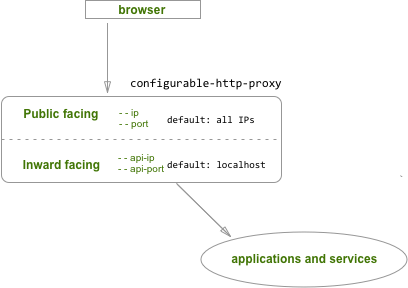

# [configurable-http-proxy](https://github.com/jupyterhub/configurable-http-proxy)

[](https://www.npmjs.com/package/configurable-http-proxy)
[](https://hub.docker.com/r/jupyterhub/configurable-http-proxy/tags)
[](https://github.com/jupyterhub/configurable-http-proxy/actions)
[](https://github.com/jupyterhub/configurable-http-proxy/issues)
[](https://discourse.jupyter.org/c/jupyterhub/z2jh-k8s)
[](https://gitter.im/jupyterhub/jupyterhub)

**configurable-http-proxy** (CHP) provides you with a way to update and manage
a proxy table using a command line interface or REST API.
It is a simple wrapper around [node-http-proxy][]. node-http-proxy is an HTTP
programmable proxying library that supports websockets and is suitable for
implementing components such as reverse proxies and load balancers. By
wrapping node-http-proxy, **configurable-http-proxy** extends this
functionality to [JupyterHub] deployments.

## Table of Contents

- [Install](#install)
- [Usage](#usage)
  - [Starting the proxy](#starting-the-proxy)
  - [Setting a default target](#setting-a-default-target)
  - [Command-line options](#command-line-options)
- [Using the REST API](#using-the-rest-api)
  - [REST API Basics](#REST-api-basics)
  - [Authenticating via passing a token](#authenticating-via-passing-a-token)
  - [Getting the routing table](#getting-the-routing-table)
  - [Adding new routes](#adding-new-routes)
  - [Deleting routes](#deleting-routes)
- [Custom error pages](#custom-error-pages)
- [Host-based routing](#host-based-routing)
- [Troubleshooting](#troubleshooting)

## Install

Prerequisite: [Node.js](https://nodejs.org/en/download/) ≥ 12

If you're installing `configurable-http-proxy` in Linux, you can follow [the instruction of nodesource](https://github.com/nodesource/distributions#installation-instructions) to install arbitrary version of Node.js.

To install the `configurable-http-proxy` package globally
using npm:

```bash
npm install -g configurable-http-proxy
```

To install from the source code found in this GitHub repo:

```bash
git clone https://github.com/jupyterhub/configurable-http-proxy
cd configurable-http-proxy
npm install  # Use 'npm install -g' for global install
```

[**Return to top**][]

## Usage

The configurable proxy runs two HTTP(S) servers:

- The **public-facing interface** to your application (controlled by `--ip`,
  `--port`)
  - listens on **all interfaces** by default.
- The **inward-facing REST API** (`--api-ip`, `--api-port`)
  - listens on localhost by default
  - The REST API uses token authorization, where the token is set in the
    `CONFIGPROXY_AUTH_TOKEN` environment variable.



[**Return to top**][]

### Starting the proxy

```bash
configurable-http-proxy [options]
```

where `[options]` are the command-line options described below.

[**Return to top**][]

### Setting a default target

The **default target** is used when a client has requested a URL for which
there is no routing target found in the proxy table. To set a
**default target**, pass the command line option,
`--default-target`, when starting the configurable proxy:

```bash
configurable-http-proxy --default-target=proto://host[:port]
```

For example:

```bash
configurable-http-proxy --default-target=http://localhost:8888
```

[**Return to top**][]

### Command-line options

```
Usage: configurable-http-proxy [options]

Options:
  -V, --version                      output the version number
  --ip <ip-address>                  Public-facing IP of the proxy
  --port <n> (defaults to 8000)      Public-facing port of the proxy
  --ssl-key <keyfile>                SSL key to use, if any
  --ssl-cert <certfile>              SSL certificate to use, if any
  --ssl-ca <ca-file>                 SSL certificate authority, if any
  --ssl-request-cert                 Request SSL certs to authenticate clients
  --ssl-reject-unauthorized          Reject unauthorized SSL connections (only meaningful if --ssl-request-cert is given)
  --ssl-protocol <ssl-protocol>      Set specific SSL protocol, e.g. TLSv1_2, SSLv3
  --ssl-ciphers <ciphers>            `:`-separated ssl cipher list. Default excludes RC4
  --ssl-allow-rc4                    Allow RC4 cipher for SSL (disabled by default)
  --ssl-dhparam <dhparam-file>       SSL Diffie-Helman Parameters pem file, if any
  --api-ip <ip>                      Inward-facing IP for API requests (default: "localhost")
  --api-port <n>                     Inward-facing port for API requests (defaults to --port=value+1)
  --api-ssl-key <keyfile>            SSL key to use, if any, for API requests
  --api-ssl-cert <certfile>          SSL certificate to use, if any, for API requests
  --api-ssl-ca <ca-file>             SSL certificate authority, if any, for API requests
  --api-ssl-request-cert             Request SSL certs to authenticate clients for API requests
  --api-ssl-reject-unauthorized      Reject unauthorized SSL connections (only meaningful if --api-ssl-request-cert is given)
  --client-ssl-key <keyfile>         SSL key to use, if any, for proxy to client requests
  --client-ssl-cert <certfile>       SSL certificate to use, if any, for proxy to client requests
  --client-ssl-ca <ca-file>          SSL certificate authority, if any, for proxy to client requests
  --client-ssl-request-cert          Request SSL certs to authenticate clients for API requests
  --client-ssl-reject-unauthorized   Reject unauthorized SSL connections (only meaningful if --client-ssl-request-cert is given)
  --default-target <host>            Default proxy target (proto://host[:port])
  --error-target <host>              Alternate server for handling proxy errors (proto://host[:port])
  --error-path <path>                Alternate server for handling proxy errors (proto://host[:port])
  --redirect-port <redirect-port>    Redirect HTTP requests on this port to the server on HTTPS
  --redirect-to <port>               Redirect HTTP requests from --redirect-port to this port
  --pid-file <pid-file>              Write our PID to a file
  --no-x-forward                     Don't add 'X-forward-' headers to proxied requests
  --no-prepend-path                  Avoid prepending target paths to proxied requests
  --no-include-prefix                Don't include the routing prefix in proxied requests
  --auto-rewrite                     Rewrite the Location header host/port in redirect responses
  --change-origin                    Changes the origin of the host header to the target URL
  --protocol-rewrite <proto>         Rewrite the Location header protocol in redirect responses to the specified protocol
  --custom-header <header>           Custom header to add to proxied requests. Use same option for multiple headers (--custom-header k1:v1 --custom-header k2:v2) (default: {})
  --insecure                         Disable SSL cert verification
  --host-routing                     Use host routing (host as first level of path)
  --metrics-ip <ip>                  IP for metrics server (default: "0.0.0.0")
  --metrics-port <n>                 Port of metrics server. Defaults to no metrics server
  --log-level <loglevel>             Log level (debug, info, warn, error) (default: "info")
  --timeout <n>                      Timeout (in millis) when proxy drops connection for a request.
  --proxy-timeout <n>                Timeout (in millis) when proxy receives no response from target.
  --storage-backend <storage-class>  Define an external storage class. Defaults to in-MemoryStore.
  -h, --help                         display help for command
```

[**Return to top**][]

## Using the REST API

The configurable-http-proxy REST API is documented and available as:

- a nicely rendered, interactive version at the
  [petstore swagger site][]
- a [swagger specification file][] in this repo

[**Return to top**][]

### REST API Basics

**API Root**

| HTTP method | Endpoint | Function |
| ----------- | -------- | -------- |
| GET         | /api/    | API Root |

**Routes**

| HTTP method | Endpoint                 | Function                            |
| ----------- | ------------------------ | ----------------------------------- |
| GET         | /api/routes              | [Get all routes in routing table][] |
| POST        | /api/routes/{route_spec} | [Add a new route][]                 |
| DELETE      | /api/routes/{route_spec} | [Remove the given route][]          |

[**Return to top**][]

### Authenticating via passing a token

The REST API is authenticated via passing a token in the `Authorization`
header. The API is served under the `/api/routes` base URL.

For example, this `curl` command entered in the terminal
passes this header `"Authorization: token $CONFIGPROXY_AUTH_TOKEN"` for
authentication and retrieves the current routing table from this endpoint,
`http://localhost:8001/api/routes`:

```bash
curl -H "Authorization: token $CONFIGPROXY_AUTH_TOKEN" http://localhost:8001/api/routes
```

[**Return to top**][]

### Getting the routing table

**Request:**

    GET /api/routes[?inactive_since=ISO8601-timestamp]

**Parameters:**

`inactive_since`: If the `inactive_since` URL
parameter is given as an [ISO8601](http://en.wikipedia.org/wiki/ISO_8601)
timestamp, only routes whose `last_activity` is earlier than the timestamp
will be returned. The `last_activity` timestamp is updated whenever the proxy
passes data to or from the proxy target.

**Response:**

_Status code_

    status: 200 OK

_Response body_

A JSON dictionary of the current routing table. This JSON
dictionary _excludes_ the default route.

**Behavior:**

The current routing table is returned to the user if the request is
successful.

[**Return to top**][]

### Adding new routes

POST requests create new routes. The body of the request should be a JSON
dictionary with at least one key: `target`, the target host to be proxied.

**Request:**

    POST /api/routes/[:path]

**Required input:**

`target`: The host URL

Example request body:

```json
{
  "target": "http://localhost:8002"
}
```

**Response:**

    status: 201 Created

**Behavior:**

After adding the new route, any request to `/path/prefix` on the proxy's
public interface will be proxied to `target`.

[**Return to top**][]

### Deleting routes

**Request:**

    DELETE /api/routes/[:path]

**Response:**

    status: 204 No Content

**Behavior:**

Removes a route from the proxy's routing table.

[**Return to top**][]

## Custom error pages

Custom error pages can be provided when the proxy encounters an error and has
no proxy target to handle a request. There are two typical errors that CHP may
hit, along with their status code:

- 404 error: Returned when a client has requested a URL for which there is no
  routing target. This error **can be prevented** by setting a
  [`default target`][] before starting the configurable-http-proxy.

- 503 error: Returned when a route exists, but the upstream server isn't
  responding. This is more common, and can be due to any number of reasons,
  including the target service having died, not finished starting, or network
  instability.

[**Return to top**][]

### Setting the path for custom error pages

When starting the CHP, specify an error path `--error-path /usr/share/chp-errors`
to the location of the error page:

```bash
configurable-http-proxy --error-path /usr/share/chp-errors
```

When a proxy error occurs, CHP will look in the following location for a
custom html error page to serve:

    /usr/share/chp-errors/{CODE}.html

where `{CODE}` is a status code number for an html page to serve. If there is
a 503 error, CHP will look for a custom error page in this location
`/usr/share/chp-errors/503.html`.

If no custom error html file exists for the error code, CHP will use the default
`error.html`. If you specify an error path, **make sure** you also create
a default `error.html` file.

[**Return to top**][]

### Setting a target for custom error handling

You can specify a target URL to use when errors occur by setting
`--error-target {URL}` when starting the CHP.

If, for example, CHP starts with `--error-target http://localhost:1234`,
and the proxy encounters an error, the proxy will make a GET request to
the `error-target` server. The GET request will be sent to the `error-target`
server URL, `http://localhost:1234`, appending the status code
`/{CODE}`, and passing the failing request's URL escaped in a URL parameter:

    GET /404?url=%2Fescaped%2Fpath

[**Return to top**][]

## Host-based routing

If the CHP is started with the `--host-routing` option, the proxy will
use the hostname of the incoming request to select a target.

When using host-based routes, the API uses the target in the same way as if
the hostname were the first part of the URL path, e.g.:

```python
{
  "/example.com": "https://localhost:1234",
  "/otherdomain.biz": "http://10.0.1.4:5555",
}
```

[**Return to top**][]

## Troubleshooting

Q: My proxy is not starting. What could be happening?

- If this occurs on Ubuntu/Debian, check that the you are using a recent
  version of node. Some versions of Ubuntu/Debian come with a version of node
  that is very old, and it is necessary to update node to a recent or `LTS`
  version.

[**Return to top**][]

[node-http-proxy]: https://github.com/nodejitsu/node-http-proxy
[jupyterhub]: https://github.com/jupyterhub/jupyterhub
[petstore swagger site]: http://petstore.swagger.io/?url=https://raw.githubusercontent.com/jupyterhub/configurable-http-proxy/HEAD/doc/rest-api.yml#/default
[swagger specification file]: https://github.com/jupyterhub/configurable-http-proxy/blob/HEAD/doc/rest-api.yml
[get all routes in routing table]: #getting-the-routing-table
[add a new route]: #adding-new-routes
[remove the given route]: #deleting-routes
[`default target`]: #setting-a-default-target
[**return to top**]: #table-of-contents
